## 📚 Table of Contents

- [PROJECT OVERVIEW](#project-overview)
- [🧱 FRAMEWORK ARCHITECHTURE](#-framework-architechture)
- [TECH STACK](#tech-stack)
- [PREREQUISITES](#prerequisites)
- [REQUIRED DEPENDENCIES](#required-dependencies)
- [HOW TO SET-UP THE TEST FRAMEWORK](#how-to-set-up-the-test-framework)
- [🌲 PROJECT TREE](#-project-tree)
- [FRAMEWORK ARCHITECTURE](#framework-architecture)
- [📌 FEATURES](#-features)
- [END POINTS COVERED](#end-points-covered)
- [✔️ TEST COVERAGE](#️-test-coverage)
  - [Happy Path Tests](#happy-path-tests)
  - [Sad Path Tests](#sad-path-tests)
- [TEST METRICS](#test-metrics)

# PROJECT OVERVIEW

This project is a robust, BDD-driven test automation framework designed to validate the Sparta Academy REST API. 
The SUT allows a user to view, edit, create and delete Spartan users and also view Courses taken by Spartans.

## 🧱 FRAMEWORK ARCHITECHTURE
The framework is built around:
- Service Object Model (SOM) for clean separation of API logic
- RestAssured for HTTP request/response handling
- Cucumber BDD (optional) for human‑readable test scenarios
- JUnit 5 for test execution
- Mockito for unit testing helper utilities
- Maven for dependency management and build automation

## TECH STACK
- Language: Java 21
- API Client: RestAssured
- Test Runner: JUnit 5 / Cucumber
- Build Tool: Maven

## PREREQUISITES
- JDK 21 or higher
- Maven 4.0.0
- IntelliJ IDEA (recommended)

## REQUIRED DEPENDENCIES
The following dependencies must be copied and synced in the pom.xml file of the project to run the tests:
- hamcrest 2.2
- slf4j-simple 2.0.7
- serenity-cucumber 3.9.8
- junit-jupiter 6.0.0
- junit-vintage-engine 6.0.0
- rest-assured 5.3.1
- json-simple 1.1.1
- jackson-databind 2.20.1
- jackson-annotations 2.20

```text
<dependencies>
        <dependency>
            <groupId>org.hamcrest</groupId>
            <artifactId>hamcrest</artifactId>
            <version>2.2</version>
        </dependency>

        <dependency>
            <groupId>org.slf4j</groupId>
            <artifactId>slf4j-simple</artifactId>
            <version>2.0.7</version>
        </dependency>

        <dependency>
            <groupId>net.serenity-bdd</groupId>
            <artifactId>serenity-cucumber</artifactId>
            <version>3.9.8</version>
            <scope>test</scope>
        </dependency>

        <dependency>
            <groupId>org.junit.jupiter</groupId>
            <artifactId>junit-jupiter</artifactId>
            <version>6.0.0</version>
            <scope>test</scope>
        </dependency>

        <dependency>
            <groupId>org.junit.vintage</groupId>
            <artifactId>junit-vintage-engine</artifactId>
            <version>6.0.0</version>
            <scope>test</scope>
        </dependency>

        <dependency>
            <groupId>io.rest-assured</groupId>
            <artifactId>rest-assured</artifactId>
            <version>5.3.1</version>
        </dependency>

        <dependency>
            <groupId>com.googlecode.json-simple</groupId>
            <artifactId>json-simple</artifactId>
            <version>1.1.1</version>
        </dependency>

        <dependency>
            <groupId>com.fasterxml.jackson.core</groupId>
            <artifactId>jackson-databind</artifactId>
            <version>2.20.1</version>
        </dependency>

        <dependency>
            <groupId>com.fasterxml.jackson.core</groupId>
            <artifactId>jackson-annotations</artifactId>
            <version>2.20</version>
            <scope>test</scope>
        </dependency>
    </dependencies>
```

## HOW TO SET-UP THE TEST FRAMEWORK
1. Clone the repository
2. The Project SDK must be set under: 
21 Oracle OpenJDK 21.0.10

The Language level must be set under: 
21 - Record patterns, pattern matching for switch


3. Install the following plugins:
   - Cucumber for Java
   - Gherkin
  


4. Run all tests using the CucumberRunnerTest file

## 🌲 PROJECT TREE
```text
API-Test-Framework-Sparta-Academy-API-/
├── .github/
│   └── workflows/
│       └── maven-publish.yml
├── .gitignore
├── .idea/
│   ├── .gitignore
│   ├── encodings.xml
│   ├── misc.xml
│   └── vcs.xml
├── pom.xml
├── README.md
└── src/
    └── test/
        ├── java/
        │   └── com/
        │       └── sparta/
        │           ├── pojos/
        │           │   ├── Course.java
        │           │   ├── LoginRequest.java
        │           │   ├── Spartan.java
        │           │   └── Stream.java
        │           ├── runner/
        │           │   └── CucumberRunnerTest.java
        │           ├── steps/
        │           │   ├── CreateNewSpartanSteps.java
        │           │   ├── DeleteSpartanSteps.java
        │           │   ├── SearchAllCoursesSteps.java
        │           │   ├── SearchAllSpartansSteps.java
        │           │   ├── SearchCourseWithIdSteps.java
        │           │   ├── SearchSpartanWithIdSteps.java
        │           │   ├── UpdateSpartanSteps.java
        │           │   └── UserLoginSteps.java
        │           └── utils/
        │               └── ApiBuilder.java
        └── resources/
            ├── config.properties
            ├── external/
            │   ├── MissingFirstNameSpartan.json
            │   ├── NewSpartan.json
            │   └── UpdatedSpartan.json
            └── features/
                ├── CreateNewSpartan.feature
                ├── DeleteSpartan.feature
                ├── SearchAllCourses.feature
                ├── SearchAllSpartans.feature
                ├── SearchCourseWithId.feature
                ├── SearchSpartanWithId.feature
                ├── UpdateSpartan.feature
                └── UserLogin.feature
```
# FRAMEWORK ARCHITECTURE

```mermaid
flowchart TD

%% =========================
%% EXECUTION LAYER
%% =========================
subgraph grp_test_entry["Execution"]
    runner["Cucumber Runner<br/>JUnit 5 Runner"]
    build["Maven Build<br/>pom.xml"]
    ci["GitHub Actions CI<br/>maven-publish.yml"]
end

%% =========================
%% BDD LAYER
%% =========================
subgraph grp_bdd["BDD Flow"]

    features["Feature Specs<br/>Gherkin Scenarios"]

    loginSteps["UserLoginSteps"]
    courseSteps["SearchAllCoursesSteps"]
    courseIdSteps["SearchCourseWithIdSteps"]

    spartanSteps["SearchAllSpartansSteps"]
    spartanIdSteps["SearchSpartanWithIdSteps"]

    createSteps["CreateNewSpartanSteps"]
    updateSteps["UpdateSpartanSteps"]
    deleteSteps["DeleteSpartanSteps"]

end

%% =========================
%% API CORE
%% =========================
subgraph grp_api_core["HTTP Core"]

    apiBuilder["ApiBuilder<br/>Request Helper"]
    restAssured["RestAssured<br/>HTTP Client"]

end

%% =========================
%% TEST DATA
%% =========================
subgraph grp_data["Test Data"]

    pojos["POJOs<br/>Course / Spartan / Stream"]
    fixtures["JSON Fixtures<br/>Test Payloads"]

end

%% =========================
%% RUNTIME
%% =========================
subgraph grp_runtime["External Runtime"]

    config["config.properties"]
    api[("Sparta Academy API")]

end

%% =========================
%% FLOW
%% =========================

ci -->|"runs"| build
build -->|"executes"| runner

runner -->|"loads"| features

features -->|"binds"| loginSteps
features -->|"binds"| courseSteps
features -->|"binds"| courseIdSteps
features -->|"binds"| spartanSteps
features -->|"binds"| spartanIdSteps
features -->|"binds"| createSteps
features -->|"binds"| updateSteps
features -->|"binds"| deleteSteps

loginSteps -->|"uses"| apiBuilder
courseSteps -->|"uses"| apiBuilder
courseIdSteps -->|"uses"| apiBuilder
spartanSteps -->|"uses"| apiBuilder
spartanIdSteps -->|"uses"| apiBuilder
createSteps -->|"uses"| apiBuilder
updateSteps -->|"uses"| apiBuilder
deleteSteps -->|"uses"| apiBuilder

apiBuilder -->|"drives"| restAssured
apiBuilder -->|"reads"| config
apiBuilder -->|"serializes"| pojos

createSteps -->|"loads"| fixtures
updateSteps -->|"loads"| fixtures

apiBuilder -->|"calls"| api

runner -->|"verifies"| api

%% =========================
%% STYLING
%% =========================

classDef blue fill:#dbeafe,stroke:#2563eb,color:#172554,stroke-width:1.5px
classDef amber fill:#fef3c7,stroke:#d97706,color:#78350f,stroke-width:1.5px
classDef green fill:#dcfce7,stroke:#16a34a,color:#14532d,stroke-width:1.5px
classDef rose fill:#ffe4e6,stroke:#e11d48,color:#881337,stroke-width:1.5px
classDef indigo fill:#e0e7ff,stroke:#4f46e5,color:#312e81,stroke-width:1.5px

class runner,build,ci blue
class features,loginSteps,courseSteps,courseIdSteps,spartanSteps,spartanIdSteps,createSteps,updateSteps,deleteSteps amber
class apiBuilder,restAssured green
class pojos,fixtures rose
class config,api indigo

%% =========================
%% CLICKABLE LINKS
%% =========================

click runner "https://github.com/anYanit/API-Test-Framework-Sparta-Academy-API-/blob/master/src/test/java/com/sparta/runner/CucumberRunnerTest.java"

click build "https://github.com/anYanit/API-Test-Framework-Sparta-Academy-API-/blob/master/pom.xml"

click ci "https://github.com/anYanit/API-Test-Framework-Sparta-Academy-API-/blob/master/.github/workflows/maven-publish.yml"

click features "https://github.com/anYanit/API-Test-Framework-Sparta-Academy-API-/tree/master/src/test/resources/features"

click loginSteps "https://github.com/anYanit/API-Test-Framework-Sparta-Academy-API-/blob/master/src/test/java/com/sparta/steps/UserLoginSteps.java"

click courseSteps "https://github.com/anYanit/API-Test-Framework-Sparta-Academy-API-/blob/master/src/test/java/com/sparta/steps/SearchAllCoursesSteps.java"

click courseIdSteps "https://github.com/anYanit/API-Test-Framework-Sparta-Academy-API-/blob/master/src/test/java/com/sparta/steps/SearchCourseWithIdSteps.java"

click spartanSteps "https://github.com/anYanit/API-Test-Framework-Sparta-Academy-API-/blob/master/src/test/java/com/sparta/steps/SearchAllSpartansSteps.java"

click spartanIdSteps "https://github.com/anYanit/API-Test-Framework-Sparta-Academy-API-/blob/master/src/test/java/com/sparta/steps/SearchSpartanWithIdSteps.java"

click createSteps "https://github.com/anYanit/API-Test-Framework-Sparta-Academy-API-/blob/master/src/test/java/com/sparta/steps/CreateNewSpartanSteps.java"

click updateSteps "https://github.com/anYanit/API-Test-Framework-Sparta-Academy-API-/blob/master/src/test/java/com/sparta/steps/UpdateSpartanSteps.java"

click deleteSteps "https://github.com/anYanit/API-Test-Framework-Sparta-Academy-API-/blob/master/src/test/java/com/sparta/steps/DeleteSpartanSteps.java"

click apiBuilder "https://github.com/anYanit/API-Test-Framework-Sparta-Academy-API-/blob/master/src/test/java/com/sparta/utils/ApiBuilder.java"

click pojos "https://github.com/anYanit/API-Test-Framework-Sparta-Academy-API-/tree/master/src/test/java/com/sparta/pojos"

click fixtures "https://github.com/anYanit/API-Test-Framework-Sparta-Academy-API-/tree/master/src/test/resources/external"

click config "https://github.com/anYanit/API-Test-Framework-Sparta-Academy-API-/blob/master/src/test/resources/config.properties"
```


## 📌 FEATURES
1. Automated tests for 3+ API endpoints
2. Happy & sad path coverage
3. Unit tests for helper logic 
4. Optional Cucumber BDD support
5. Clean, modular framework structure

## END POINTS COVERED
At least three endpoints are fully validated, including:

1. /Auth/login
   - POST request
   - Validate response code
   - Validate response body

2. /api/Courses
   - GET request for all and singular Courses using IDs
   - Validate response code
   - Validate approriate response body retrieved

3. /api/Spartans
   - GET request for all and singular Spartans using IDs
   - POST request for creating new Spartans
   - PUT request for updating Spartans
   - DELETE request for deleting a Spartan
   - Validate response codes
   - Validate appropriate response bodies retrieved
  
## ✔️ TEST COVERAGE
### Happy Path Tests
1. Valid requests return correct status codes
2. Response body contains expected fields
3. Schema validation

### Sad Path Tests
1. Missing fields
2. Invalid data types
3. Incorrect credentials
4. Trying to request without authorization

## TEST METRICS
A total of 25 test were created with 22 passing and 3 failing. All tests passed with a percentage rate of 88%. 

It was discovered that all failing tests were due to unexpected response codes being returned after using the GET API for both retrieving specific Courses and Spartans that were non-existent and also the POST API for creating a new Spartan.
Although tests failed due to unexpected response codes, the actually expected functionality of each API call still worked as intended:
- A GET request for a non-existent Course and Spartan returned an 204 No Content response as the Course/Spartan didnt exist
- A POST request to create a new Spartan returned a 500 Internal Server Error response and yet the new Spartan is still created and added to the system


